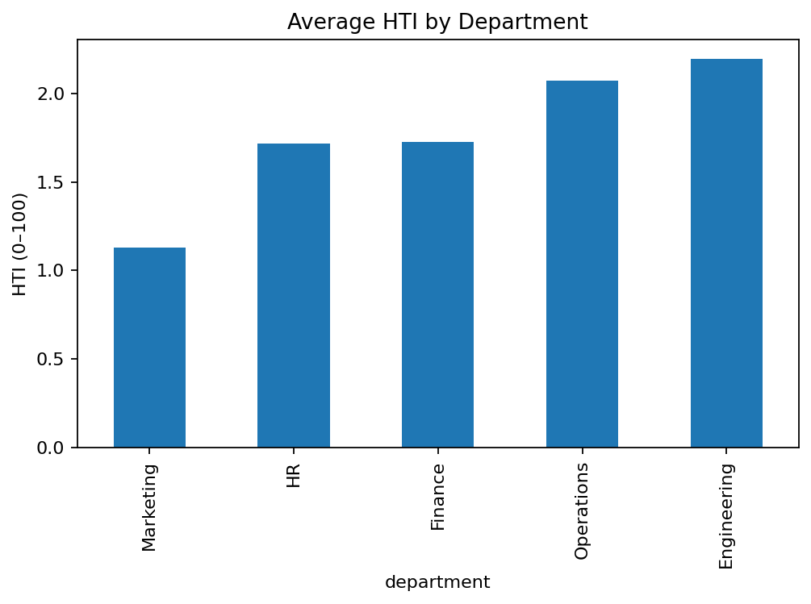
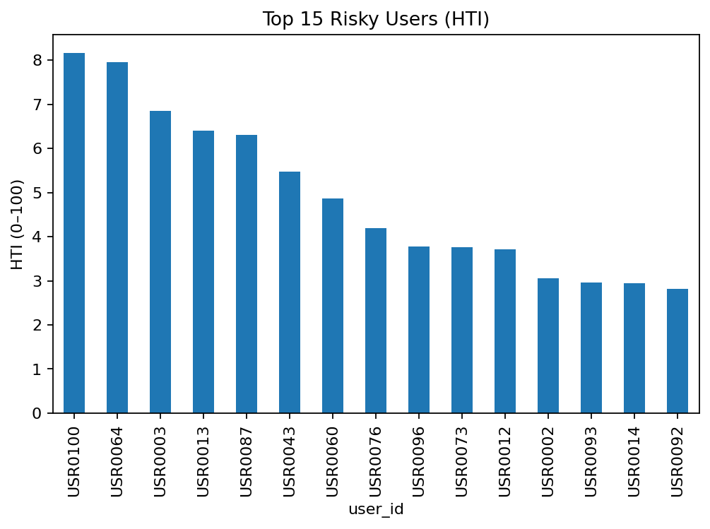
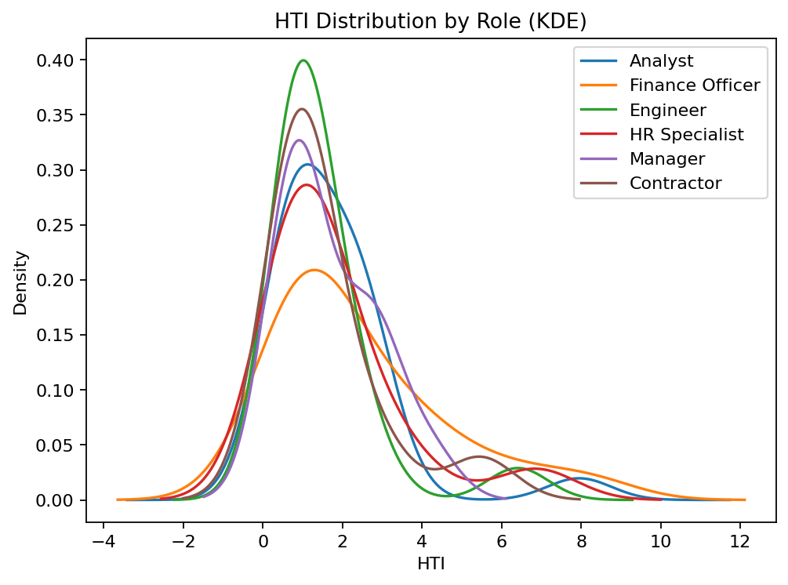
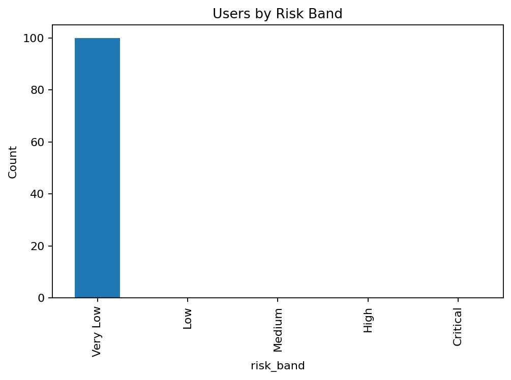

# HERA — OMEO Risk Report

**Objective:** Summarize human-centric risk posture with OMEO context.

## Executive Summary

- Average HTI: **1.8**

- Highest-risk departments (avg HTI):

| department   |   avg_HTI |
|:-------------|----------:|
| Engineering  |      2.19 |
| Operations   |      2.07 |
| Finance      |      1.73 |
| HR           |      1.72 |
| Marketing    |      1.13 |

## Top 10 Risky Users

| user_id   | department   | role            |   HTI |
|:----------|:-------------|:----------------|------:|
| USR0100   | Engineering  | Finance Officer |  8.17 |
| USR0064   | Operations   | Analyst         |  7.95 |
| USR0003   | Finance      | HR Specialist   |  6.86 |
| USR0013   | Operations   | Engineer        |  6.41 |
| USR0087   | Operations   | Finance Officer |  6.3  |
| USR0043   | HR           | Contractor      |  5.47 |
| USR0060   | Finance      | Finance Officer |  4.87 |
| USR0076   | Engineering  | Manager         |  4.2  |
| USR0096   | HR           | Finance Officer |  3.77 |
| USR0073   | Engineering  | Finance Officer |  3.76 |

## Risk Bands (counts)

| risk_band   |   count |
|:------------|--------:|
| Very Low    |     100 |
| Low         |       0 |
| Medium      |       0 |
| High        |       0 |
| Critical    |       0 |

## OMEO Summary

**Top Methods**

| method                               |   count |
|:-------------------------------------|--------:|
| data-exfiltration / privilege-misuse |      84 |
| social-engineering (phishing)        |      10 |
| anomalous-behavior (time/geo)        |       4 |
| normal-operations                    |       2 |

## Visuals

| Avg HTI by Department | Top 15 Risky Users |
|---|---|
|  |  |
| HTI Distribution by Role | Risk Band Counts |
|---|---|
|  |  |